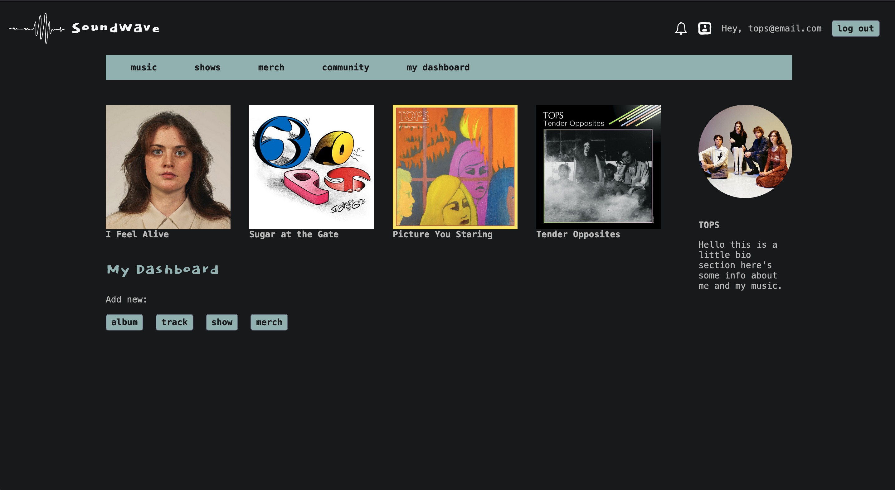

# SoundWave

Inspired by Bandcamp, SoundWave is an online music community where independent musicians can showcase their work, discover new music, and build meaningful connections with other artists. 

Capstone project for the Concordia University Web Development Diploma. 

## Technologies Used

* React.js
* Node.js, Express.js
* Firebase - Firestore Database, Authentication, Storage
* Spotify Web API & REST API principles
* HTML/CSS, Styled Components 

## Features

* Artists can create an account and build a profile, where they can:
  - Showcase their discography
  - Upload new albums, including track lists, cover art, and audio files 
  - Post upcoming tour dates

- Discover new artists: 
  - Search by artist, genre, or track
  - Browse artists by genre 
  - View upcoming and featured artists (newly created accounts)
 
## Future Features & Additions

* Implement *fans* as second type of user
  * Fans will be able to follow their favourite artists, showcase their record collections, and comment on album releases  
* Marketplace where artists can accept payments for music and merchandise 
* Google Maps API integration to show concert venue locations

